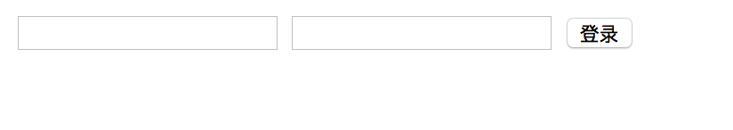
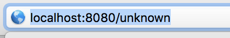

# cloudgo-io

设计一个 web 小应用，展示静态文件服务、js 请求支持、模板输出、表单处理、Filter 中间件设计等方面的能力。（不需要数据库支持）

#### 基本要求

1. 支持静态文件服务
2. 支持简单 js 访问
3. 提交表单，并输出一个表格
4. 对 /unknown 给出开发中的提示，返回码 5xx

可以通过以下博客来进行设计和完成作业

[golang web 服务器 request 与 response 处理](https://blog.csdn.net/pmlpml/article/details/78539261)

### 完成结果如下：
#### 静态文件服务

#### 简单js访问

#### 提交表单并输出表格

#### 对/unknown给出开发中提示，返回码5xx

